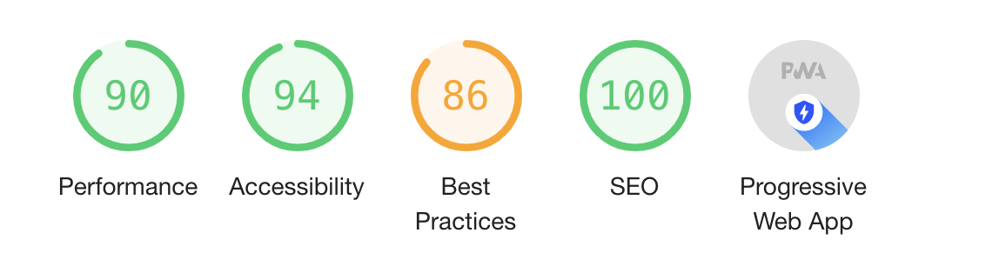

# Dept-case :smirk:

> Practice Case for Dept Agency

I went more for the Technical Developer role, but I also like the visual part...
Here you can find a short overview of what I did in the last days.

## Table of contents
1. Build setup
2. Tooling
3. Features
4. Accesibility
5. API
6. Optimalisation

## 1. Build Setup

No `.env` needed to run project.

To run the project:


``` bash
# install dependencies
$ npm install

# serve with hot reload at localhost:3000
$ npm run dev

# build for production and launch server
$ npm run build
$ npm run start

# generate static project
$ npm run generate
```

## 2. Tooling

What did I use for this project?

- Nuxt.js
  https://nuxtjs.org/<br>
  The power of Vue.js but with SSR. To make sure Google can index all content on the page, we want to pre-render everything on the server.

- Vuex 
  https://vuex.vuejs.org/<br>
  For statemanagement

- Express
  https://expressjs.com/<br>
  Node webapplication framework. To serve our Nuxt-app, but also our API to consume data.

- Webpack
  https://webpack.js.org/<br>
  Nuxt already uses webpack, but I also use it to optimize Images etc.

- Jest
  https://jestjs.io/<br>
  For unit-testing

## 3. Features

### Hero
Adjusted the design a bit here, to render different images (SSR).

### Filters
You can group/filter by `Industry` and `Type` and you can toggle between a `list` view and a `grid` view.

Filters are dynamicallystored in in the URL.
See `pages/index.vue` for serverside data call. 

If a user sets some filters, they can share the filtered page. Because everything is also SSR avaidable! :innocent:

Store filters in query string.
We use axios to get the data, if a data related query changes.
So when you toggle `grid` to `list` only the querystring is updated and the store is called.

## Grid
Not that special.
I've added a feauture to toggle between a grid and a list view.

Needs a refactor on Grid.vue, this thing got blown up a bit.. Maybe look for a CSS only solution?

## Lazyload images
I lazyload all the grid images :fire:, to speed everything up!

## Clients
Not that special.

Need to swap images on mobile so every client is seen.

## Contact Form
I use veevalidate to validate form rules.

See: https://logaretm.github.io/vee-validate/

## Modern images
All images are served as `webp` if browser supports it (see CaseBase.vue).

Thanks to: https://github.com/bazzite/nuxt-optimized-images

## 4. Accesibility

- Able to navigate through whole website with tab, space, enter, escape.
- Alt's provided

## 5. API
See: `./server/index.js`

I've added two REST endpoints to mock some data calls, to embrace SSR in combination with the filters in the URL.

```
/api/v1/cases
/api/v1/clients
```

The only thing those endpoints do is serving and filtering json files (see: `./server/mock-data`).

## 6. Optimalisation (Lighthouse)
To test if our website is performing well I make use of Lighthouse by Google.

This website scored:


Some score could be better but some colors in the design are not readable enough... That's why best practices is off.

## Compression
See: https://www.npmjs.com/package/nuxt-compress

## Progressive Web App
To make this website a Supercharge PWA, I used the following package: https://pwa.nuxtjs.org/


### Jest (Unit tests)

I've set up two (really) simple tests to show the concept of testing in an enviorment like this.

See `/test` for all tests.

```
Navigation.spec.js
NavigationToggle.spec.js
Logo.spec.js
```

To run tests

```
npm run jest
```

For detailed explanation on how things work, check out [Nuxt.js docs](https://nuxtjs.org).


### Next steps

- Add 404 and 500 page.
- Add fancier animations
- Add deploy scripts
